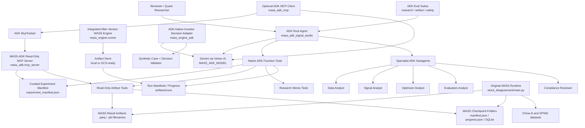
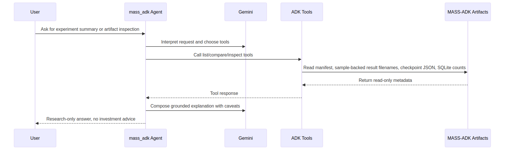
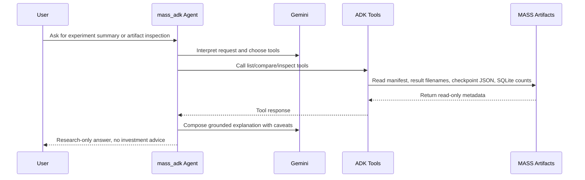
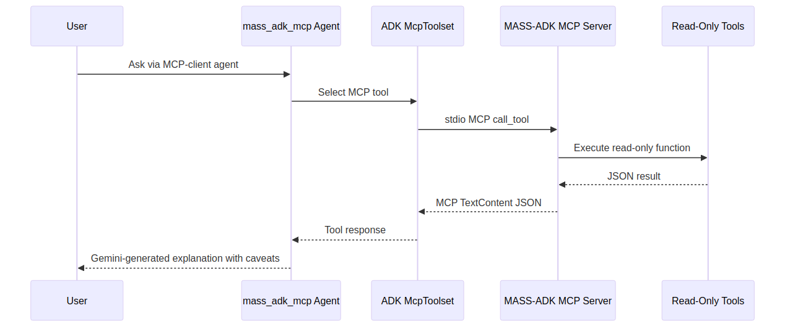
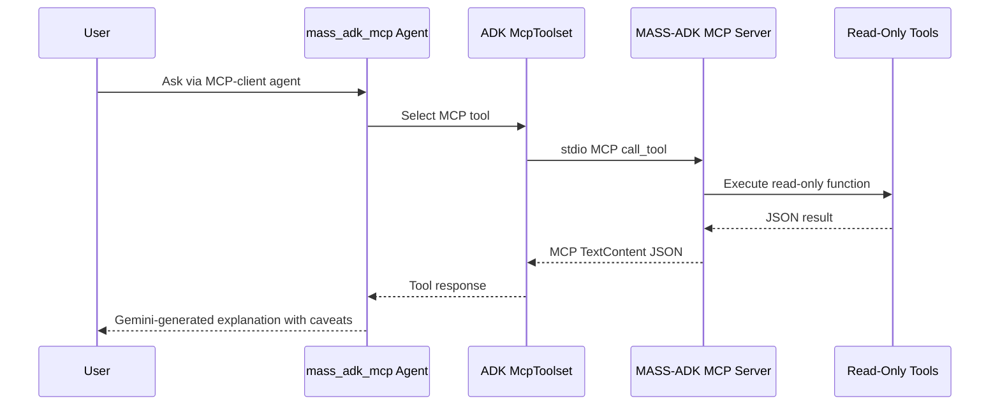

# MASS-ADK Architecture

## Overview

MASS-ADK is a productionization layer around the original MASS multi-agent financial signal research engine.

Original MASS remains responsible for expensive investor-agent simulations and artifact generation. MASS-ADK provides Google ADK orchestration, Gemini-powered analysis, read-only artifact tools, ADK evals, MCP integration, and finance-safety reporting.

## High-Level Architecture

Rendered image:


Mermaid source:



## Runtime Boundary

| Layer | Environment | Main responsibility |
| --- | --- | --- |
| Original MASS | `twinmarket` | Live/offline simulations, checkpoints, signal artifacts |
| Integrated MASS engine | `mass-adk` | After-version dry-run manifests, guarded smoke execution, local/GCS-ready artifact routing |
| ADK investor adapter | `mass-adk` | Synthetic one-step investor decision demo using ADK tools and structured JSON |
| MASS-ADK | `mass-adk` | ADK/Gemini analysis, read-only inspection, evals, MCP, demo UX |

This separation keeps the original research engine stable while allowing the ADK layer to be iterated quickly for competition and productionization work.

## Native ADK Flow

Rendered image:



Mermaid source:



## MCP Flow

Rendered image:



Mermaid source:



## Data And Artifact Sources

MASS-ADK currently uses two evidence sources.

Curated cached evidence:

```text
mass_adk/data/experiment_manifest.json
```

Original MASS runtime artifacts:

```text
other_repo/MASS/stock_disagreement/res/
other_repo/MASS/stock_disagreement/res/checkpoints/
```

The artifact tools are read-only. They inspect:

- configured MASS paths,
- result filenames and sizes,
- checkpoint `manifest.json`,
- checkpoint `progress.json`,
- per-date shard counts,
- SQLite table names and row counts.

They do not currently parse parquet or pickle contents.

Integrated after-version run metadata:

```text
MASS_adk/artifacts/runs/<run_id>/manifest.json
MASS_adk/artifacts/runs/<run_id>/progress.json
```

The integrated `mass_engine.runner --smoke` path defaults to dry-run metadata creation. Live execution is guarded by `MASS_ADK_ENABLE_LIVE_RUNS=true`.

## Safety Controls

Safety controls are implemented through prompts, tool boundaries, and evals.

| Control | Implementation |
| --- | --- |
| No trading recommendations | Root and specialist prompts |
| Research-only framing | Root, compliance, and MCP-client prompts |
| Signal vs return distinction | Prompts and eval rubrics |
| Single-seed caveats | Manifest, prompts, eval rubrics |
| No expensive default live runs | `run_smoke_experiment` disabled and excluded from MCP |
| Read-only MCP tools | MCP server exposes inspection tools only |
| Guarded integrated engine | `mass_engine.runner --smoke` defaults to dry-run records |

## Deployment Path

Current state is local development and review.

Recommended production path:

1. Deploy MASS-ADK as an ADK app or Cloud Run service.
2. Keep MCP read-only tools as a sidecar or separate Cloud Run service.
3. Store MASS artifacts in GCS or a controlled artifact store.
4. Run large MASS simulations as offline jobs, Cloud Run Jobs, or batch jobs.
5. Let MASS-ADK inspect artifacts after completion instead of launching expensive runs interactively.

## Competition-Relevant Capabilities

| Criterion | Architecture support |
| --- | --- |
| Technical implementation | ADK agents, tools, MCP server, MCP client, evals, artifact inspection |
| Business case | Quant research workflow for evaluating LLM-derived financial signals |
| Innovation | Multi-agent disagreement signal research plus ADK productionization |
| Demo and presentation | Deterministic cached evidence, real local artifacts, safety prompt, evals |
