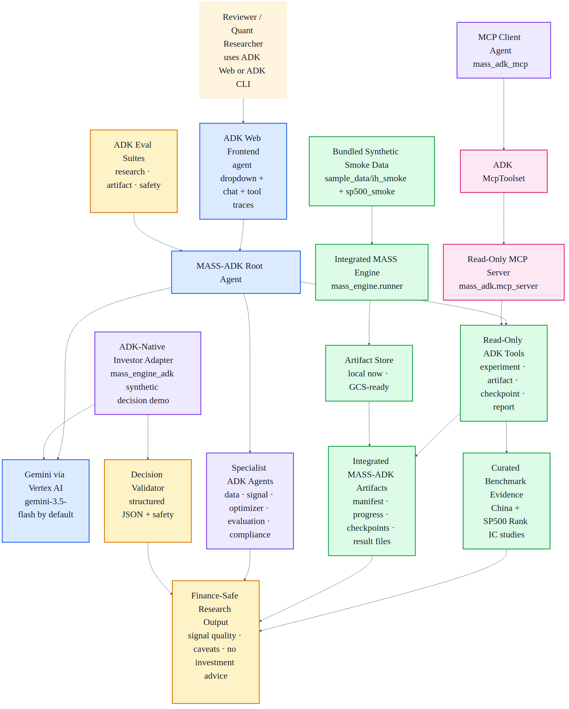

# MASS-ADK Signal Studio

MASS-ADK packages the MASS (Multi-Agent Simulation Scaling for Portfolio Construction) multi-agent stock-selection research workflow as a Google ADK agent application for the Google for Startups AI Agents Challenge. Please see original research [here](https://github.com/gta0804/MASS)

The first implementation focuses on reliable, auditable research over cached MASS benchmark evidence. Expensive live LLM runs are disabled by default and should only be enabled for tiny smoke tests.

## What Problem This Solves

LLM-based financial research agents can generate useful market hypotheses, but prototype systems are hard to trust when their runs are expensive, outputs are scattered across local files, and responses can accidentally sound like investment advice.

MASS-ADK turns a multi-agent financial signal research workflow into a reviewer-friendly ADK application that can:

- run a tiny self-contained smoke simulation,
- inspect generated artifacts and checkpoints,
- explain cached benchmark results with caveats,
- expose safe read-only tools through MCP,
- evaluate agent responses with ADK eval,
- present everything through ADK Web.

The goal is not to automate trading. The goal is to help researchers audit and understand LLM-derived stock-ranking signals before any downstream human-reviewed portfolio process.

## What The MASS Engine Does

The integrated `mass_engine` is the simulation and artifact-generation layer.

At a high level it:

1. Creates multiple synthetic investor agents with different investing styles.
2. Gives each agent a stock universe and market context.
3. Collects each agent's selected stocks for each trading date.
4. Aggregates those choices into signal features such as consensus and disagreement.
5. Applies optimizer logic such as simulated annealing or CMA-ES to construct stock-ranking signals.
6. Writes auditable outputs: result files, distribution files, checkpoint state, run manifests, and progress records.
7. Evaluates signal quality with metrics such as Rank IC and ICIR.

For reviewer testing, `mass_engine` uses tiny bundled synthetic datasets under `sample_data/`. This lets reviewers verify installation, LLM calls, checkpointing, artifact routing, and ADK inspection without downloading the full research dataset.

## How MASS-ADK Adds Value

MASS-ADK is the Google ADK/Gemini productionization layer around that engine.

| Layer | What it contributes |
| --- | --- |
| `mass_engine` | Runs the self-contained smoke simulation and writes artifacts/checkpoints |
| `mass_adk` | Main ADK/Gemini agent for explaining experiments, artifacts, and caveats |
| `mass_engine_adk` | Small ADK-native investor-decision adapter using synthetic data and JSON output |
| `mass_adk_mcp` | ADK MCP-client agent that consumes read-only MASS-ADK tools through MCP |
| `mass_adk.mcp_server` | Read-only MCP server exposing experiment and artifact inspection tools |
| ADK evals | Rubric-based checks for research quality, artifact behavior, and finance safety |

Together, these pieces demonstrate a Track 2 optimization path: converting an agentic finance research prototype into an auditable, testable, ADK-native workflow with MCP and safety guardrails.

## What This Agent Does

- Lists completed MASS experiments from a curated manifest.
- Runs and inspects self-contained sample-backed MASS engine smoke artifacts.
- Includes an isolated after-version `mass_engine` snapshot with guarded dry-run manifests.
- Includes a small ADK-native investor-decision adapter for synthetic demo decisions.
- Exposes read-only MASS inspection tools through an MCP stdio server.
- Explains the MASS consensus/disagreement signal mechanism.
- Compares baseline SA and improved CMA-ES mechanisms.
- Summarizes China and SP500 transfer evidence.
- Generates research-only memos with caveats and no-financial-advice language.

This is a portfolio-construction signal research assistant, not an autonomous trading system.

## Architecture



Additional rendered diagrams:

- [Native ADK flow](assets/native_adk_flow.png)
- [MCP flow](assets/mcp_flow.png)

Diagram sources are stored as Mermaid files under `assets/` and documented in `ARCHITECTURE.md`.

## Setup

Use the dedicated `mass-adk` conda environment for the ADK app, integrated engine
smoke tests, MCP tools, and evals.

```bash
cd MASS_adk
conda env create -f environment.yml
conda activate mass-adk
cp .env.example .env
```

If the environment already exists:

```bash
conda activate mass-adk
pip install -e ".[eval]"
```

Update `.env` as needed. The default model is:

```bash
MASS_ADK_MODEL=gemini-3.5-flash
```

For Vertex AI access, use a model-serving location where the selected Gemini
model is available. `asia-south1` may work for some Google Cloud services but
can return `404 NOT_FOUND` for `gemini-3.5-flash` publisher-model calls.

Recommended local setting for this project:

```bash
GOOGLE_CLOUD_LOCATION=global
```

If you intentionally want regional model serving, test the target region first.
Some regions may support other Gemini models but not `gemini-3.5-flash` through
the same Vertex publisher-model endpoint.

Fallback candidate:

```bash
GOOGLE_CLOUD_LOCATION=us-central1
```

Keep deployment region separate from model-serving location:

```bash
MASS_ADK_DEPLOY_REGION=us-central1
```

`GOOGLE_CLOUD_LOCATION=global` is used for Gemini model lookup in local ADK
runs. `MASS_ADK_DEPLOY_REGION` should be a real deployable Google Cloud region
for future Agent Runtime or Cloud Run deployment.

## Run Locally

```bash
conda activate mass-adk
adk run mass_adk
```

or:

```bash
conda activate mass-adk
adk web
```

The agent uses Gemini through ADK, so real `adk run` queries require valid Google/Gemini credentials in `.env` or the shell environment.

For a formal reviewer-oriented command list, see `REVIEWER_INSTRUCTIONS.md`.

Submission and presentation assets:

| Document | Purpose |
| --- | --- |
| `SUBMISSION.md` | Competition-facing project brief, business case, evidence, and testing summary |
| `DEVPOST_SUBMISSION_DRAFT.md` | Copy-ready submission narrative in past-winner style |
| `PRESENTATION_STRATEGY.md` | Presentation guidance from official guide and reviewed past submissions |
| `ARCHITECTURE.md` | Mermaid architecture diagrams for native ADK and MCP flows |
| `DEMO_SCRIPT.md` | Step-by-step 3-5 minute video/demo script |
| `ADK_WEB_DEMO.md` | ADK Web frontend guide with prompt cards and UI verification checklist |
| `DEPLOYMENT.md` | Local, MCP, GCS, Cloud Run, and Agent Runtime deployment notes |
| `REVIEWER_INSTRUCTIONS.md` | Complete command list and pass criteria for reviewers |

## ADK Web Frontend

MASS-ADK uses ADK Web as its lightweight demo frontend. This showcases the Google ADK framework directly instead of adding a custom UI layer.

Start the ADK Web demo:

```bash
conda activate mass-adk
bash scripts/launch_adk_web_demo.sh
```

Open:

```text
http://127.0.0.1:8501
```

Then select one of the project agents from the ADK Web dropdown:

```text
mass_adk
mass_engine_adk
mass_adk_mcp
```

See `ADK_WEB_DEMO.md` for prompt cards and video walkthrough steps.

## Integrated MASS Engine

MASS-ADK includes an isolated after-version MASS runtime snapshot:

```text
mass_engine/
```

Run a safe dry-run smoke manifest through the integrated engine:

```bash
conda activate mass-adk
python -m mass_engine.runner --smoke
```

This uses bundled synthetic sample data under `sample_data/ih_smoke` and does not
require the full research dataset. It does not launch a live MASS simulation. It
writes auditable run records to:

```text
artifacts/runs/<run_id>/manifest.json
artifacts/runs/<run_id>/progress.json
```

Inspect those records through ADK:

```bash
adk run mass_adk "List integrated MASS engine runs and explain how the packaged after-version writes auditable artifacts."
```

Live execution remains guarded by `MASS_ADK_ENABLE_LIVE_RUNS=true` and should only be used for tiny smoke runs.

Run the full live sample-backed smoke test with:

```bash
MASS_ADK_ENABLE_LIVE_RUNS=true python -m mass_engine.runner --smoke --execute
```

This makes live LLM calls and uses the bundled synthetic sample dataset. The
sample data is for verification only, not research conclusions.

## ADK-Native Investor Adapter

MASS-ADK does not convert every MASS runtime class into an ADK agent. Most MASS
classes are simulation, optimization, state, or checkpointing components and are
better kept as Python engine code.

For demonstration, the project includes one ADK-native investor decision adapter:

```text
mass_engine_adk/
```

Run it with:

```bash
adk run mass_engine_adk "Use the demo investor decision case, select two synthetic stocks, validate the decision, and return the final JSON."
```

This adapter uses synthetic data only and demonstrates how a single MASS investor
decision step can be represented with ADK tools, Gemini reasoning, structured
JSON output, and finance-safety rules.

## Validate Install

```bash
conda run -n mass-adk python -m pytest -q
conda run -n mass-adk python -c "import mass_adk.agent as agent; print(agent.MODEL); print(agent.root_agent.name)"
conda run -n mass-adk python -c "import numpy, pandas, scipy, tqdm, openai, pyarrow, cma, backoff, retrying, yaml; print('engine deps ok')"
conda run -n mass-adk env PYTHONPATH=mass_engine python -m stock_disagreement.main --help
conda run -n mass-adk python -m mass_engine.runner --smoke
conda run -n mass-adk adk --help
```

The copied engine live-execution path is intentionally guarded. This command
should be blocked unless `MASS_ADK_ENABLE_LIVE_RUNS=true` is set:

```bash
conda run -n mass-adk python -m mass_engine.runner --smoke --execute
```

## Run ADK Eval

Install the ADK eval extra if this environment was created before eval support
was added:

```bash
conda activate mass-adk
pip install -e ".[eval]"
```

Then run the research eval fixture:

```bash
adk eval mass_adk eval/data/mass_adk_research.test.json \
  --config_file_path eval/research_eval_config.json \
  --print_detailed_results
```

With ADK 2.2, `adk eval` expects the agent package directory (`mass_adk`), not
the `mass_adk/__init__.py` file, despite the current CLI help text mentioning a
module file path.

The custom `eval/eval_config.json` uses rubric-based semantic evaluation. The
default ADK eval criteria use exact tool trajectory matching and ROUGE-style text
overlap, which are too brittle for the long-form MASS research summaries.

Additional eval sets are available for artifact inspection and finance-safety
guardrails. See `REVIEWER_INSTRUCTIONS.md` for the complete command list.

## MCP Server

MASS-ADK includes a local stdio MCP server exposing read-only experiment and
artifact-inspection tools:

```bash
conda activate mass-adk
python -m mass_adk.mcp_server --list-tools
```

The server intentionally excludes live-run tools. It exposes inspection tools
such as `list_available_experiments`, `compare_experiments`,
`validate_mass_runtime_paths`, `list_mass_checkpoints`, and
`inspect_mass_checkpoint`.

An optional ADK MCP-client agent is available:

```bash
adk run mass_adk_mcp "List MASS experiments through MCP and explain the evidence caveats."
```

Use the default `mass_adk` agent for the main demo. Use `mass_adk_mcp` when you
want to demonstrate the MCP integration path explicitly.

## Troubleshooting

### `404 NOT_FOUND` for `gemini-3.5-flash`

Example error:

```text
Publisher Model `projects/.../locations/asia-south1/publishers/google/models/gemini-3.5-flash` was not found
```

This means ADK reached Vertex AI, but the selected model is not available in the
configured `GOOGLE_CLOUD_LOCATION`.

Fix `.env`:

```bash
GOOGLE_GENAI_USE_VERTEXAI=true
GOOGLE_CLOUD_LOCATION=global
```

Then rerun:

```bash
conda activate mass-adk
adk run mass_adk "List the completed MASS experiments available in this demo."
```

If you need to test regional serving, try a supported model-serving region such
as `us-central1`, but keep `global` as the known-good local setting for this
project.

```bash
GOOGLE_CLOUD_LOCATION=us-central1
```

Alternative: use Google AI Studio/Gemini API key mode instead of Vertex AI:

```bash
GOOGLE_GENAI_USE_VERTEXAI=false
GOOGLE_API_KEY=your-ai-studio-api-key
```

The bucket region and the Gemini model-serving region are separate concerns.
For demos, prefer a bucket in or near the serving region, but the immediate model
lookup failure is controlled by `GOOGLE_CLOUD_LOCATION`.

## Self-Contained Smoke Artifacts

MASS-ADK includes bundled synthetic smoke data under:

```text
sample_data/ih_smoke
sample_data/sp500_smoke
```

Reviewers can run the integrated engine without downloading the full research
dataset:

```bash
MASS_ADK_ENABLE_LIVE_RUNS=true python -m mass_engine.runner --smoke --execute
```

The smoke run writes artifacts under:

```text
artifacts/mass_engine/results/
artifacts/mass_engine/results/checkpoints/
artifacts/runs/<run_id>/manifest.json
artifacts/runs/<run_id>/progress.json
```

The current artifact tools inspect paths, filenames, checkpoint JSON, shard
counts, and SQLite table counts. They do not parse parquet or pickle contents
yet. The bundled sample data validates execution plumbing only and should not be
treated as research evidence.

Useful ADK prompts:

```text
Validate the self-contained MASS-ADK smoke setup and confirm whether reviewers need any external dataset.
```

```text
List integrated MASS-ADK result artifacts for the ih stock pool.
```

```text
Inspect the checkpoint ih_2_2_False_False_5_False_20230615_20230620_False_sa_Signal_std_False_0.0_seed01_std and summarize whether the smoke run completed.
```

## Demo Prompts

```text
List the completed MASS experiments available in this demo and identify which are multi-seed versus single-seed.
```

```text
Compare the original SA baseline and the improved CMA-ES mechanism at 512 agents.
```

```text
Summarize the strongest MASS-ADK evidence for SP500 transfer and explain the caveats.
```

```text
Generate a research memo for a quant lead explaining whether MASS should be used as an upstream signal generator for portfolio construction.
```

```text
Inspect integrated MASS-ADK result artifacts and explain how they connect the ADK app to the sample-backed engine smoke run.
```

## Safety Positioning

MASS-ADK reports signal-quality evidence such as Rank IC and ICIR. It does not recommend buying or selling securities, does not execute trades, and does not provide investment advice.
